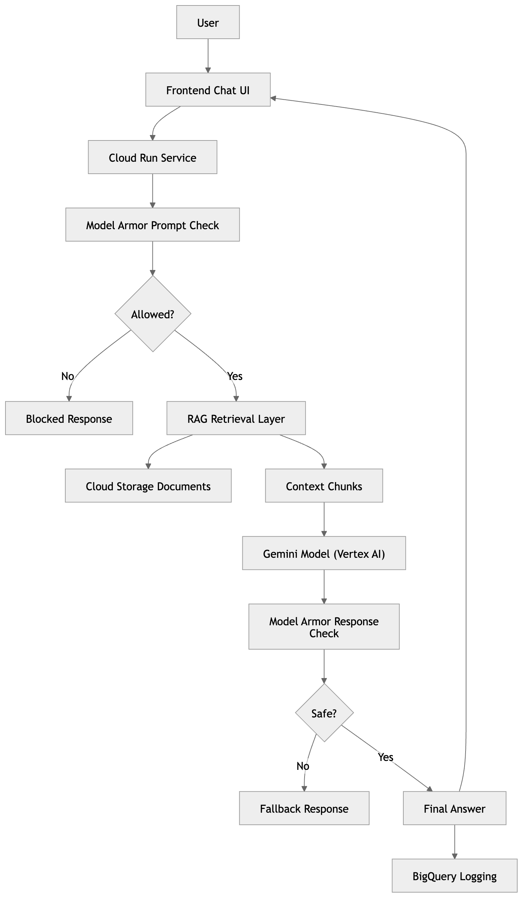

# Alaska Department of Snow – AI Online Agent

## Overview

This project implements a **secure, scalable AI-powered chatbot** for the Alaska Department of Snow (ADS) to reduce call center load during snow events.

The solution uses:

* Retrieval-Augmented Generation (RAG)
* Google Vertex AI (Gemini)
* Google Model Armor for safety
* Vertex AI Evaluation API
* BigQuery logging
* Cloud Run deployment

---

## Architecture

<p align="center">
  
</p>

```mermaid
flowchart TD
    A[User] --> B[Frontend Chat UI]
    B --> C[Cloud Run Service]

    C --> D[Model Armor Prompt Check]
    D --> E{Allowed?}

    E -- No --> F[Blocked Response]

    E -- Yes --> G[RAG Retrieval Layer]
    G --> H[Cloud Storage Documents]

    G --> I[Context Chunks]

    I --> J[Gemini Model (Vertex AI)]

    J --> K[Model Armor Response Check]
    K --> L{Safe?}

    L -- No --> M[Fallback Response]
    L -- Yes --> N[Final Answer]

    N --> O[BigQuery Logging]
    N --> B
```

---

## Features

### AI Capabilities

* Context-aware answers using RAG
* Source citation from ADS documents
* Hallucination prevention

### Security & Safety

* Google Model Armor integration
* Prompt injection protection
* Response validation
* Defense-in-depth approach

### Observability

* BigQuery logging for all interactions
* Status tracking (success, blocked, etc.)

### Evaluation

* Vertex AI Gen AI Evaluation
* Metrics:

  * groundedness
  * safety
  * coherence
  * instruction following

---

## Tech Stack

* FastAPI (backend)
* Vertex AI (Gemini)
* Google Cloud Storage (data)
* BigQuery (logging)
* Model Armor (security)
* Cloud Run (deployment)
* HTML/CSS/JS (frontend)

---

## Local Setup

```bash
git clone <repo>
cd alaska-dept-of-snow-agent

python -m venv venv
source venv/bin/activate

pip install -r requirements.txt
```

Create `.env`:

```env
PROJECT_ID=your-project-id
LOCATION=us-central1
MODEL_NAME=gemini-1.5-flash

GCS_BUCKET=labs-roitraining-com
GCS_PREFIX=alaska-dept-of-snow

LOG_DATASET=ads_agent_logs
LOG_TABLE=prompt_response_logs

MODEL_ARMOR_TEMPLATE_ID=ads-safety-template
MODEL_ARMOR_LOCATION=us-central1
```

Run locally:

```bash
uvicorn app.main:app --reload
```

Open UI:

```text
http://localhost:8000
```

---

## Evaluation

```bash
python -m evaluation.generate_eval_responses
python -m evaluation.run_evaluation
```

Results are stored in Vertex AI Experiments.

---

## Deployment

```bash
gcloud builds submit --config cloudbuild.yaml
```

Access your deployed app:

```text
https://ads-online-agent-xxxxx-uc.a.run.app
```

---

## Key Design Decisions

### RAG over pure LLM

Ensures answers are grounded in ADS-approved data.

### Model Armor

Prevents:

* prompt injection
* data exfiltration
* unsafe outputs

### Cloud Run

* Scalable
* Cost-efficient
* Stateless deployment

### BigQuery Logging

* Auditability
* Monitoring
* Future analytics

---

## Demo Script (Interview)

1. Ask a normal question → show grounded answer with sources
2. Ask unknown question → show fallback (no hallucination)
3. Ask malicious prompt → show Model Armor blocking
4. Show BigQuery logs
5. Show evaluation results

---

## Future Improvements

* Replace keyword RAG with vector search (Vertex AI Search)
* Streaming responses
* User authentication
* Real-time snow data APIs
* Multilingual support

---

## Conclusion

This project demonstrates a **production-ready GenAI system** with:

* Strong grounding via RAG
* Robust safety using Model Armor
* Observability through BigQuery
* Measurable quality via Vertex AI Evaluation

It is designed to be scalable, secure, and suitable for public-facing government use.
